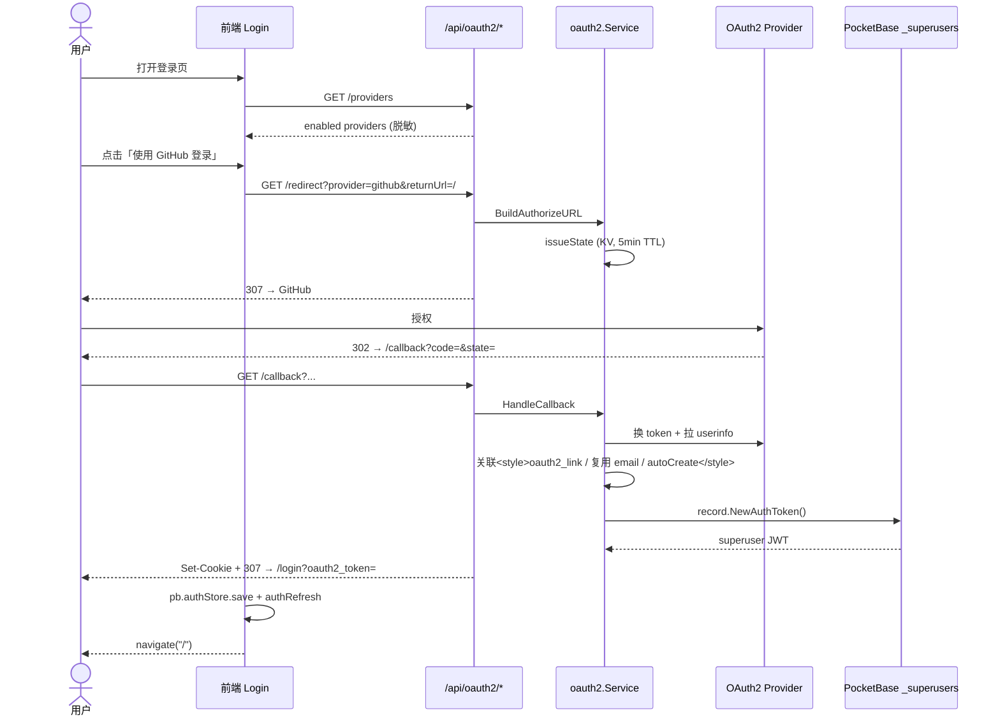

# OAuth2 单点登录 (SSO) 集成指南

<div align="center">

[English](./oauth2.md) ｜ 简体中文

</div>

Certimate 从 v0.4.31 开始支持通过 OAuth2 进行单点登录 (SSO)。管理员可在「设置 → OAuth2」中配置一个或多个 OAuth2 身份提供商，登录页将依次出现对应的「使用 XXX 登录」按钮；点击后跳至第三方完成授权，回到 Certimate 后即自动登录为超级管理员。

---

## 目录

- [特性概览](#特性概览)
- [内置提供商](#内置提供商)
- [快速上手：以 GitHub 为例](#快速上手以-github-为例)
- [高级配置](#高级配置)
  - [自动创建超级管理员](#自动创建超级管理员)
  - [自定义端点 / 字段映射](#自定义端点--字段映射)
  - [一个 provider 接入多个租户](#一个-provider-接入多个租户)
- [API 与回调流程](#api-与回调流程)
- [数据库结构变化](#数据库结构变化)
- [架构说明（给二次开发者）](#架构说明给二次开发者)
- [安全须知](#安全须知)
- [常见问题](#常见问题)

---

## 特性概览

- **零侵入**：复用 PocketBase 已有的 `_superusers` 超级管理员账户体系与 JWT 鉴权，颁发的 token 与现有「账号密码登录」完全等价，前端 `authStore`、`authRefresh` 流程不变。
- **可扩展**：内置 6 种常见 OAuth2 提供商预设（见下表），任意 OAuth2 兼容身份提供商只需填好 3 个 URL + 字段映射即可接入。
- **无需修改内置 collection**：不依赖 PocketBase 内置 OAuth2 集合配置，避免破坏已有 superuser 表结构。
- **安全默认值**：未配置时登录页与原行为完全一致；通过 `autoCreate` 严格保护，杜绝未授权用户自行获取超级管理员权限。

## 内置提供商

下列 ID 即「提供商名」（在 Settings 中作为 `name` 字段）。各字段留空时按预设自动填充。

| name        | 显示名             | 默认 Scopes          | 默认 Subject 字段 |
| ----------- | ------------------ | -------------------- | ----------------- |
| `github`    | GitHub             | `read:user`          | `id`              |
| `gitlab`    | GitLab             | `read_user`          | `id`              |
| `gitee`     | Gitee              | `user_info`          | `id`              |
| `google`    | Google             | `openid email profile` | `sub`           |
| `azuread`   | Microsoft (Azure AD) | `openid email profile` | `sub`           |
| `dingtalk`  | DingTalk           | _(空)_               | `openId`          |
| `authentik` | Authentik (自托管) | `openid email profile` | `sub`           |

> 其他提供商（如腾讯云鳄梨、Auth0、Keycloak、通用 OIDC 等）只需按[自定义端点](#自定义端点--字段映射)一节填入对应 URL 与字段名即可接入，无需改动代码。
>
> Authentik 是 **自托管 IdP**，访问它的端点分别带有主机名 + 应用 slug，不能像 GitHub 那样开箱即用。预设只预填 scope 与字段映射；管理员需在表单中显式填入 3 个端点。详见 [Authentik 接入示例](#authentik-接入示例)。

## 快速上手：以 GitHub 为例

> 假设你的 Certimate 部署在 `https://cert.example.com`。

### 1. 在 GitHub 侧创建 OAuth App

打开 <https://github.com/settings/developers> → **New OAuth App**，填写：

- **Homepage URL**: `https://cert.example.com`
- **Authorization callback URL**: `https://cert.example.com/api/oauth2/callback?provider=github`

注册成功后会得到 **Client ID** 与 **Client Secret**，记下来。

> 注意：回调地址末尾必须带 `?provider=github` query 参数（也支持用其它 provider 名）。这个 URL 既要在 GitHub 注册，也要在「Settings → OAuth2」的 Redirect URL 字段中相同填写。

### 2. 在 Certimate 中配置

用密码登录后进入 **设置 → OAuth2**：

1. 点击「Add github」按钮，列表中新增 GitHub 折叠面板。
2. 展开面板填写：

| 字段             | 取值                                                         |
| ---------------- | ------------------------------------------------------------ |
| 启用             | ✓                                                            |
| Display Name     | `GitHub`（或任意你喜欢的名字，会展示在登录页按钮上）         |
| Client ID        | 第 1 步拿到的 Client ID                                       |
| Client Secret    | 第 1 步拿到的 Client Secret                                   |
| Redirect URL     | `https://cert.example.com/api/oauth2/callback?provider=github` |

点击保存即可。

### 3. 验证

退出登录回到 `/login`：

- 登录表单下方会出现分隔线「or」和「Sign in with GitHub」按钮。
- 点击按钮 → GitHub 授权页面 → 自动跳回 `/login?oauth2_token=...` → 自动登录并跳转到首页。

---

## Authentik 接入示例

假设你的 Authentik 实例部署在 `https://auth.example.com`，要为 Certimate 创建一个 OAuth2 应用。

### 1. 在 Authentik 側创建 OAuth2/OpenID Connect Provider

进入 **Authentik Admin Interface → Applications → Providers** → **Create → OAuth2/OpenID Provider**：

- **Name**: `certimate`
- **Authentication flow**: 选默认 `default-authentication-flow`（或你的定制流）
- **Client type**: `Confidential`
- **Client ID** / **Client Secret**: Authentik 会生成
- **Redirect URIs / Origins**: `https://cert.example.com/api/oauth2/callback?provider=authentik`
- **Scopes**: 勾选 `openid:openid`, `email:email`, `profile:profile`

创建成功后记下 **Client ID** 与 **Client Secret**。Authentik 还会在 provider 详情页直接给出三个端点 URL（请划出 application slug）：

- `https://auth.example.com/application/o/certimate/authorize/`
- `https://auth.example.com/application/o/certimate/token/`
- `https://auth.example.com/application/o/certimate/userinfo/`

### 2. 在 Certimate 中配置

登录后进入 **设置 → OAuth2** → 点击「Add authentik」→展开面板填：

| 字段              | 取值 |
| ------------------ | ------------------------------------------------------------ |
| 启用               | ✓ |
| Display Name       | `Authentik`（会展示在登录页按钮上） |
| Client ID           | 第 1 步拿到 |
| Client Secret       | 第 1 步拿到 |
| Redirect URL         | `https://cert.example.com/api/oauth2/callback?provider=authentik` |
| Scopes (空格分隔)   | `openid email profile`（预设默认，不需修改） |
| Authorization URL  | `https://auth.example.com/application/o/certimate/authorize/` |
| Token URL           | `https://auth.example.com/application/o/certimate/token/` |
| UserInfo URL        | `https://auth.example.com/application/o/certimate/userinfo/` |
| Subject 字段名      | `sub`（OIDC 标准，认证不需修改） |
| 自动创建超级管理员 | 按需勾选 |

点击保存。

### 3. 验证

与 GitHub 示例相同：退出登录 → `/login` 会出现「Sign in with Authentik」按钮 → 点击 → Authentik 授权页 → 跳回 `/login?oauth2_token=...` → 自动登录。

---

## 高级配置

### 自动创建超级管理员

默认情况下，**没有预先绑定账号的 OAuth2 身份**会被告知「administrators must first link it in settings」。这是有意为之，避免任何能通过你 OAuth App 授权的第三方用户直接拿到超级管理员权限。

如果希望首次使用未绑定的 OAuth2 身份登录时**自动**创建超级管理员账户，可在配置表单中：

| 字段               | 作用                                                                                          |
| ------------------ | --------------------------------------------------------------------------------------------- |
| 自动创建超级管理员 | 开启后，未找到绑定时将自动创建 `_superusers` 记录                                            |
| 邮箱前缀           | 当 OAuth2 用户信息缺失邮箱时构造占位邮箱，形如 `<prefix>+<provider>+<subject>@certimate.local` |

自动创建的账户会生成一个随机强密码（用户不知道也不需要），管理员可在「设置 → 账号」用 OAuth2 登录后再修改或绑定邮箱。

### 自定义端点 / 字段映射

某些企业内部 IdP（GitLab 自建、Casdoor、Keycloak、Auth0、OIDC 通用实现等）的端点不在内置预设里，需要在表单中显式填写：

| 字段              | 说明                                              | 示例                                                          |
| ----------------- | ------------------------------------------------- | ------------------------------------------------------------- |
| Authorization URL | 授权端点                                          | `https://auth.mycompany.com/oauth2/authorize`                |
| Token URL         | 令牌端点                                          | `https://auth.mycompany.com/oauth2/token`                     |
| UserInfo URL      | UserInfo 端点                                     | `https://auth.mycompany.com/oauth2/userinfo`                  |
| Subject 字段名    | 从 UserInfo JSON 中读取的唯一身份 ID（256 字符内） | `sub` / `id` / `openId` / `preferred_username`                 |
| Scopes (空格分隔) | 请求的 scope 列表                                 | `openid profile email`                                        |
| Scopes Join       | 非 OAuth2 标准时 scope 拼接的分隔符（默认空格）   | 微信、企业微信场景可能需要填 `,`                               |

> 字段映射仅 `subject` 暴露在 UI 中（出于安全核心考虑），`email / name / avatar` 仍以预设或固定规则映射到 PocketBase superuser 上下文，不在前端暴露。

### 一个 provider 接入多个租户

在「设置 → OAuth2」一次「Add」可以追加多个同名或不同名条目；登录页按钮顺序与「设置」中折叠面板顺序一致。同一 provider 可以注册多个不同的 Client ID（比如个人 GitHub App + 企业 GitHub App），按 `name` 区分链接记录，互不冲突。

---

## API 与回调流程

未鉴权公开端点（不挂在 `/api` 的 `RequireSuperuserAuth` 中间件下）：

| 方法 | 路径                          | 说明                                                                              |
| ---- | ----------------------------- | --------------------------------------------------------------------------------- |
| GET  | `/api/oauth2/providers`       | 列出已启用的 provider（脱敏，含 `name`、`displayName`、`scopes`、`authUrl` 等） |
| GET  | `/api/oauth2/redirect`        | 携 `provider`、`returnUrl`、可选 `redirectUrl` 触发跳转                            |
| GET  | `/api/oauth2/callback`        | OAuth2 提供商回调，颁发 token 并 307 跳回前端                                       |

### 完整时序

```
1. 用户        GET https://cert.example.com/api/oauth2/redirect?provider=github&returnUrl=/
2. Certimate   校验 provider 启用 + 凭据；生成一次性 state（PocketBase KV，5 分钟 TTL）
               307 跳转到 https://github.com/login/oauth/authorize?client_id=...&state=...
3. 用户        在 GitHub 授权
4. GitHub      302 跳回 https://cert.example.com/api/oauth2/callback?provider=github&code=...&state=...
5. Certimate   校验 state（provider 相同 + 未过期）；用 code 换 access_token；拉 UserInfo
               按 (provider, subjectId) 在 oauth2_link 中查找关联；未找到则尝试 email 复用 / autoCreate
               调用 PocketBase record.NewAuthToken() 颁发 superuser JWT
               Set-Cookie: certimate_oauth2_token (HttpOnly, 60s)
               307 跳转到 returnUrl?oauth2_token=...
6. 前端        Login 页 useEffect 检测到 oauth2_token，调 pb.authStore.save(token)
               调 pb.collection('_superusers').authRefresh() 拉回完整 record
               清除 URL 上的临参，navigate('/')
```

详见仓库根目录 README 的流程图：



---

## 数据库结构变化

迁移文件 `migrations/1790568000_upgrade_v0.4.31.go` 在升级时自动执行，仅做两件事：

1. 新增 collection `oauth2_link`：

   | 字段               | 类型      | 说明                                  |
   | ------------------ | --------- | ------------------------------------- |
   | `provider`         | text      | OAuth2 提供商标识/github、gitlab 等 |
   | `subjectId`        | text      | 用户在 OAuth2 提供商处的唯一 ID       |
   | `superuserId`      | text      | 关联的 `_superusers.id`              |
   | `userProfileEmail` | text      | 最近一次拉取到的 email 快照           |
   | `userProfileName`  | text      | 昵称快照                              |
   | `userProfileAvatar`| text      | 头像 URL 快照                         |
   | `created`/`updated`| autodate  | 自动维护                              |

   唯一索引：`(provider, subjectId)`；普通索引：`(provider, superuserId)`。

2. 在 `settings` 集合中预置一条空记录 `name = "oauth2"`。

> 升级是幂等的。`__submodule` 引入的 `pkg/sdk3rd-forked/` 缺失不影响该迁移，但仍需先 `git submodule update --init --recursive` 才能整体 `go build ./...`。

---

## 架构说明（给二次开发者）

### 关键代码位置

| 包 / 文件                                  | 职责                                                                                  |
| ------------------------------------------ | ------------------------------------------------------------------------------------- |
| `internal/domain/oauth2_link.go`           | `OAuth2Link` 领域模型与 collection 名常量                                            |
| `internal/domain/settings.go`              | `SettingsContentForOAuth2` 结构与 `AsOAuth2()` 解码                                   |
| `internal/oauth2/providers.go`             | 内置预设（端点 + 字段映射）                                                            |
| `internal/oauth2/oauth2.go`                | 核心服务：URL 生成、state 管理、token 交换、userinfo 拉取、关联或自动创建 superuser   |
| `internal/repository/oauth2_link.go`       | `oauth2_link` 集合的 CRUD                                                              |
| `internal/rest/handlers/oauth2.go`          | 三个公开 HTTP 端点                                                                    |
| `internal/rest/routes/routes.go`            | 在 **root router**（非 superuser `group`）上注册 OAuth2 路由                          |
| `internal/settings/{settings.go,pbstore.go}`| 注册 `oauth2` settings store；`GetGlobalSettingsForOAuth2()` 局部取值                  |
| `internal/domain/dtos/oauth2.go`           | 入参/出参 DTO                                                                          |
| `migrations/1790568000_upgrade_v0.4.31.go` | 自动迁移                                                                              |
| `ui/src/repository/oauth2.ts`              | 列 provider、触发跳转、消费 token 回调                                                |
| `ui/src/stores/settings/oauth2/index.ts`   | `useOAuth2SettingsStore`                                                              |
| `ui/src/pages/settings/SettingsOAuth2.tsx` | 管理员配置页                                                                          |
| `ui/src/pages/login/Login.tsx`             | 渲染登录按钮、自动消费 token                                                          |

### 关键设计

1. **绕开 `/api` 中间件层级**：OAuth2 路由直接挂在 root router 子组上，绕过 `apis.RequireSuperuserAuth()`，否则跳转会立刻 401。
2. **复用 PocketBase JWT**：手动调用 `record.NewAuthToken()` 拿到与「密码登录」完全等价的 token；前端用 `pb.authStore.save() + authRefresh()` 让原 SDK 逻辑无感刷新。
3. **state 一次性 + 校验 provider 一致**：避免跨 provider 复用 CSRF state。
4. **未启用 OAuth2 时降级到原行为**：登录页对 `/providers` 返回空列表时隐藏按钮区，零回归风险。

---

## 安全须知

- **clientSecret 仅写、不出列表**：`GET /api/oauth2/providers` 永远剥离 `clientSecret`，仅供登录页知道启用了哪些 provider。
- **state**：随机 24 字节 + base64url，存在 PocketBase KV，TTL 5 分钟，回调时校验 provider 匹配后立即删除。
- **returnUrl 同源校验**：仅允许跳转到与 callback 请求同 host 的相对地址，杜绝开放重定向。
- **自动创建默认关闭**：未在「设置」中勾选 `autoCreate` 时，未绑定身份将拒绝登录并提示需管理员手动链接。
- **HttpOnly cookie + 短 TTL**：登录 token 同时通过 60s HttpOnly cookie 传递一次，便于在 query 不可见场景仍可消费。
- **建议**：在生产环境务必通过 HTTPS 部署 Certimate（与 OAuth2 提供商要求一致），并妥善保管 `clientSecret`。

---

## 常见问题

### 1. 登录页没有出现「使用 XXX 登录」按钮？

依次检查：

- 「设置 → OAuth2」是否至少有一个 provider 启用？
- 该 provider 是否填写了 `Client ID` 和 `Client Secret`？（服务端 `GetProvider` 会校验）
- 浏览器开发者工具中 `GET /api/oauth2/providers` 返回的 `providers` 是否为空数组。

### 2. 回调时报 `oauth2 state does not match provider`？

`state` 是签发时绑定到具体 provider 的，确保跳转请求里的 `provider` 与回调一致。手工修改 URL 或刷新太久（>5 分钟）也会触发此错误。

### 3. 回调时报 `no superuser linked to oauth2 provider ...`？

这是「未开启 autoCreate 且 (provider, subject) 未预先绑定」的正常表现。两种解决：

- 在「设置」中开启对应 provider 的「自动创建超级管理员」。
- 或先用密码登录创建一个 superuser，再用一个支持其邮箱 Identity 的 OAuth2 provider 登录：服务端在关联未命中时会尝试用 OAuth2 userinfo 中的邮箱匹配已有 `_superusers` 并自动创建绑定，之后即可直接 OAuth2 登录。

### 4. 升级前数据是否会被清空？

不会。迁移仅「新增 collection 和 settings 记录」且幂等，不影响 `workflow / certificate / access` 等已有数据。

### 5. 可不可以接 OIDC？

可以。OIDC 本质就是 OAuth2 + 标准 userinfo，把 `authUrl/tokenUrl/userInfoUrl` 填好、`Subject 字段名` 设为 `sub`、`Scopes` 加上 `openid` 即可。

---

如需进一步定制（如加入 PKCE 扩展、支持 OIDC `id_token` 校验、邮箱归属域名白名单等），可参考 `internal/oauth2/oauth2.go` 的接口结构扩展。一个常见的扩展点是把 `ResolveProvider` 或 `HandleCallback` 拆分为多个 provider-specific impl，按 `provider.Name` 走不同子流程。